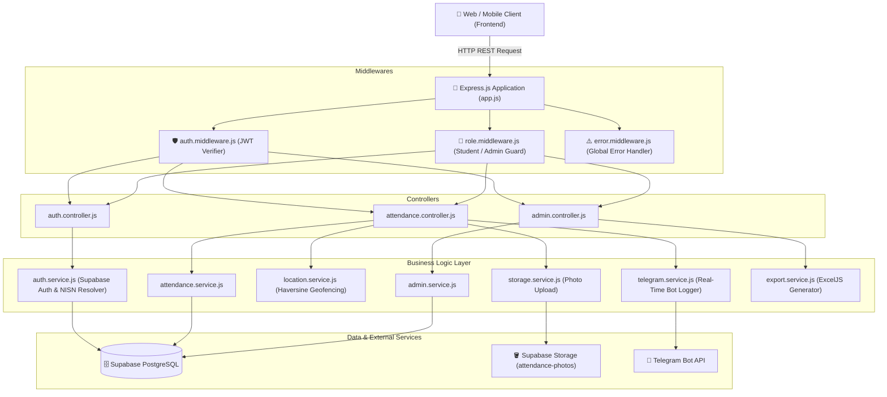
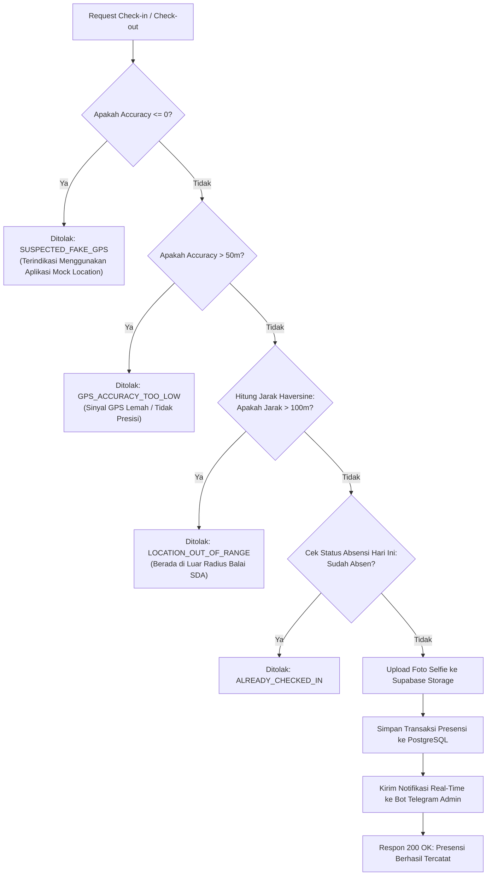

# 🛰️ Backend API — Sistem Presensi Online Siswa PKL
### SMK Taruna Bhakti di Direktorat Bina Teknik Sumber Daya Air (Kementerian PUPR)


---

## 📌 1. Deskripsi Proyek

Repositori ini berisi implementasi **Backend REST API** untuk aplikasi **Presensi Online Siswa Praktik Kerja Lapangan (PKL)** SMK Taruna Bhakti yang ditempatkan di **Direktorat Bina Teknik Sumber Daya Air (Balai SDA)**.

Sistem dirancang tangguh dengan mengutamakan:
* **Keamanan & Anti-Cheat**: Validasi radius kantor berbasis geofencing GPS (Haversine Formula), deteksi anomali Mock/Fake GPS, serta bukti foto selfie presensi.
* **Autentikasi Fleksibel (Dual Identifier)**: Siswa dapat masuk menggunakan **NISN** maupun **Email** secara dinamis, sementara akun Admin menggunakan Email.
* **Monitoring Real-Time**: Notifikasi otomatis presensi siswa (masuk/pulang) dikirim secara langsung ke grup/channel admin melalui **Telegram Bot Logger**.
* **Pelaporan Otomatis**: Generator laporan rekapitulasi presensi otomatis ke dalam format spreadsheet resmi **Microsoft Excel (`.xlsx`)**.

---

## 🏗️ 2. Arsitektur Sistem

Proyek ini mengadopsi **Clean 3-Tier Layered Architecture** yang memisahkan tanggung jawab antara routing, controller logika HTTP, dan service pemrosesan data bisnis.



---

## 📂 3. Struktur Direktori Proyek

```text
backend/
├── api/
│   └── index.js                    # Serverless entrypoint untuk deployment Vercel
├── database/
│   └── schema.sql                  # Skema DDL PostgreSQL, RLS, trigger, & index unik NISN
├── src/
│   ├── config/
│   │   └── supabase.js             # Supabase Client & Supabase Admin SDK init
│   ├── controllers/
│   │   ├── auth.controller.js      # Controller login (NISN/Email), reset password, profile
│   │   ├── attendance.controller.js# Controller check-in, check-out, status hari ini
│   │   └── admin.controller.js     # Controller dashboard admin, rekapitulasi, export excel
│   ├── services/
│   │   ├── auth.service.js         # Logika autentikasi, lookup NISN ke email, password update
│   │   ├── attendance.service.js   # Logika check-in/out, anti-duplikasi hari yang sama
│   │   ├── location.service.js     # Formula Haversine, validasi jarak kantor, deteksi Fake GPS
│   │   ├── storage.service.js      # Parser base64 & upload foto ke Supabase Storage
│   │   ├── telegram.service.js     # Real-time event notification ke Telegram Bot admin
│   │   ├── export.service.js       # Generator laporan ExcelJS dengan custom styling
│   │   └── admin.service.js        # Filter riwayat, paginasi admin, & register siswa
│   ├── routes/
│   │   ├── auth.routes.js          # Rute /api/auth
│   │   ├── attendance.routes.js    # Rute /api/attendance
│   │   └── admin.routes.js         # Rute /api/admin
│   ├── middlewares/
│   │   ├── auth.middleware.js      # Verifikasi Bearer token JWT Supabase
│   │   ├── role.middleware.js      # Otorisasi role: 'admin' vs 'user'
│   │   └── error.middleware.js     # Global handler format response error JSON
│   ├── utils/
│   │   └── response.js             # Standard JSON response helper & ERROR_CODES dictionary
│   ├── app.js                      # Express App setup, CORS, rate limiting, route binding
│   └── server.js                   # Server listen entrypoint & startup diagnostic logger
├── test/
│   └── api.test.js                 # Automated Test Suite (15/15 passing tests)
├── .env.example                    # Template environment variables lengkap
├── .gitignore                      # Git ignore file (aman dari node_modules, .env, script lokal)
├── package.json                    # Project manifest & dependencies
├── vercel.json                     # Konfigurasi rewrite serverless Vercel
└── WBS_Jadwal_Proyek_Presensi_PKL.xlsx # Dokumen WBS penjadwalan proyek 2 minggu
```

---

## ⚙️ 4. Konfigurasi Environment (`.env`)

Salin file `.env.example` menjadi `.env` di folder `backend/`:

```bash
cp .env.example .env
```

Isi variabel konfigurasi berikut:

| Variabel | Tipe | Wajib? | Keterangan |
|---|---|---|---|
| `PORT` | Number | Opsional | Port server lokal (default: `5000`). |
| `NODE_ENV` | String | Opsional | `development` atau `production`. |
| `SUPABASE_URL` | String | **Wajib** | URL instance Supabase Anda (`https://<project-id>.supabase.co`). |
| `SUPABASE_ANON_KEY` | String | **Wajib** | Kunci anonim untuk autentikasi client umum. |
| `SUPABASE_SERVICE_ROLE_KEY` | String | **Wajib** | Kunci service role admin (akses database internal & user management). |
| `OFFICE_NAME` | String | Opsional | Nama titik kantor (default: `Direktorat Bina Teknik Sumber Daya Air`). |
| `OFFICE_LATITUDE` | Float | Opsional | Titik Latitude kantor Balai SDA (`-6.899380`). |
| `OFFICE_LONGITUDE` | Float | Opsional | Titik Longitude kantor Balai SDA (`107.618610`). |
| `OFFICE_RADIUS_METERS` | Number | Opsional | Radius toleransi presensi dalam meter (default: `100`). |
| `MAX_GPS_ACCURACY_METERS`| Number | Opsional | Batas maksimal deviasi akurasi GPS pengguna (default: `50`). |
| `TELEGRAM_BOT_TOKEN` | String | Opsional | Token Bot dari Telegram `@BotFather` untuk real-time log. |
| `TELEGRAM_CHAT_ID` | String | Opsional | ID Chat personal atau Group/Channel admin untuk menerima notifikasi. |
| `FRONTEND_URL` | String | Opsional | URL root frontend untuk tautan reset password (default: `http://localhost:5173`). |
| `FRONTEND_RESET_URL` | String | Opsional | Rute form ubah password frontend (`http://localhost:5173/reset-password`). |

---

## 🚀 5. Cara Menjalankan Server & Pengujian

### A. Instalasi Dependensi
```bash
npm install
```

### B. Mode Development (Hot Reload)
```bash
npm run dev
```

### C. Mode Production
```bash
npm start
```

### D. Menjalankan Automated Test Suite
Sistem dilengkapi dengan unit test otomatis tanpa mock external untuk menguji endpoint, geofencing, parser, dan Excel generator:
```bash
npm test
```
*Output: 15/15 test cases LULUS (0 Gagal).*

---

## 📖 6. Dokumentasi Lengkap Endpoint REST API

Format Respons Seragam:
* **Sukses**: `{ "success": true, "message": "...", "data": { ... } }`
* **Error**: `{ "success": false, "message": "...", "error": { "code": "...", "details": ... } }`

---

### A. Sistem & Health Check (`/api/health`)

| Method | Endpoint | Auth | Deskripsi |
|---|---|---|---|
| `GET` | `/` | Publik | Root endpoint informasi versi API |
| `GET` | `/api/health` | Publik | Status server, uptime, koneksi Supabase & status Telegram bot |
| `GET` | `/api/health/telegram` | Publik | Mengirim pesan uji coba instan ke Telegram untuk memastikan bot aktif |

---

### B. Autentikasi Pengguna (`/api/auth`)

Sistem mendukung **Dual Identifier**: parameter `identifier` dapat diisi **Email** (Admin / Siswa) atau **NISN** (Siswa).

| Method | Endpoint | Header | Request Body | Keterangan |
|---|---|---|---|---|
| `POST` | `/api/auth/login` | - | `{ "identifier": "242510046", "password": "..." }` | Login via NISN atau Email |
| `POST` | `/api/auth/forgot-password` | - | `{ "email": "siswa@email.com" }` | Kirim link reset password ke email |
| `POST` | `/api/auth/reset-password` | `Bearer <token>` | `{ "password": "newPassword123" }` | Eksekusi ubah password via token reset |
| `POST` | `/api/auth/change-password` | `Bearer <token>` | `{ "old_password": "...", "new_password": "..." }` | Ubah password saat login |
| `GET` | `/api/auth/me` | `Bearer <token>` | - | Mengambil data profil siswa/admin yang sedang login |

---

### C. Presensi Siswa PKL (`/api/attendance`)
*Semua endpoint wajib menyertakan header:* `Authorization: Bearer <access_token>`

| Method | Endpoint | Request Body / Query | Keterangan |
|---|---|---|---|
| `POST` | `/api/attendance/check-in` | `{ "latitude": -6.8993, "longitude": 107.6186, "accuracy": 15, "photo": "data:image/jpeg;base64,..." }` | Rekam presensi masuk hari ini |
| `POST` | `/api/attendance/check-out` | `{ "latitude": -6.8993, "longitude": 107.6186, "accuracy": 15, "photo": "data:image/jpeg;base64,..." }` | Rekam presensi pulang |
| `GET` | `/api/attendance/today` | - | Cek status absensi hari ini (`has_checked_in`, `has_checked_out`) |
| `GET` | `/api/attendance/history` | `?start_date=2026-09-01&end_date=2026-09-30&limit=10` | Riwayat presensi siswa yang bersangkutan |
| `GET` | `/api/attendance/:id` | Parameter ID Presensi | Detail lengkap satu record kehadiran |

---

### D. Panel Admin & Laporan Rekapitulasi (`/api/admin`)
*Wajib menyertakan:* `Authorization: Bearer <token>` dan memiliki `role: 'admin'`.

| Method | Endpoint | Query / Body | Keterangan |
|---|---|---|---|
| `GET` | `/api/admin/attendance/today` | - | Monitoring seluruh siswa yang hadir hari ini |
| `GET` | `/api/admin/attendance/history` | `?page=1&limit=20&user_id=&start_date=` | Seluruh riwayat presensi semua siswa PKL |
| `GET` | `/api/admin/attendance/export` | `?start_date=&end_date=` | **Download file laporan resmi Excel (`.xlsx`)** |
| `GET` | `/api/admin/students` | - | Daftar semua data siswa PKL terdaftar |
| `POST` | `/api/admin/students` | `{ "email", "password", "full_name", "nisn", "school", "major" }` | Pendaftaran akun siswa PKL baru oleh admin |

---

## 🛡️ 7. Mekanisme Anti-Cheat & Keamanan Presensi



1. **Haversine Distance Geofencing**:
   Jarak dihitung secara akurat dalam satuan meter antara koordinat HP siswa dan koordinat Balai Bina Teknik SDA (`-6.899380, 107.618610`). Jika jarak $> 100\text{ meter}$, absensi otomatis ditolak.
2. **Deteksi Fake GPS**:
   Nilai akurasi GPS $\le 0$ merupakan pola umum aplikasi mock GPS spoofing pada perangkat seluler dan langsung ditolak (`SUSPECTED_FAKE_GPS`).
3. **Penyaringan Sinyal Lemah**:
   Jika deviasi GPS $> 50\text{ meter}$, siswa diminta menuju area terbuka agar titik koordinat valid (`GPS_ACCURACY_TOO_LOW`).
4. **Validasi Waktu Server**:
   Waktu presensi diambil murni dari server PostgreSQL (`timezone('utc'::text, now())`), sehingga manipulasi jam pada HP siswa tidak berpengaruh.
5. **Jaminan Anti-Duplikasi (Database Level)**:
   Constraint `UNIQUE (user_id, attendance_date)` menjamin 1 siswa hanya dapat membuat 1 sesi presensi per tanggal kalender.

---

## 🤖 8. Integrasi Telegram Bot Logger

Setiap kali ada siswa yang melakukan **Check-in** atau **Check-out**, bot Telegram akan langsung mengirimkan notifikasi real-time ke grup/channel admin:

```text
🔔 LOG PRESENSI SISWA PKL

Nama Siswa   : Alif Alfathar
NISN         : 242510046
Sekolah      : SMK Taruna Bhakti
Tipe         : CHECK-IN (MASUK)
Waktu        : 04/09/2026, 07:45:12 WIB
Jarak Kantor : 18.5 meter
Status       : ✅ Tepat Waktu
Lokasi       : Direktorat Bina Teknik Sumber Daya Air
```

Untuk menguji apakah bot Telegram kamu sudah tersambung, akses:
```http
GET http://localhost:5000/api/health/telegram
```

---

## 📅 9. Penjadwalan Proyek (Work Breakdown Structure)

Proyek ini dirancang dan diselesaikan dalam jangka waktu **2 Minggu (14 Hari Kalender)**. Dokumen jadwal WBS resmi berformat Excel dapat diakses langsung pada:
📄 **[WBS_Jadwal_Proyek_Presensi_PKL.xlsx](./WBS_Jadwal_Proyek_Presensi_PKL.xlsx)**

### Alokasi Tanggung Jawab Tim Pengembang (3 Orang):
* **Alif Alfathar (Lead Developer & Backend Architecture)**:
  * Inisialisasi Arsitektur REST API & Express.js Setup.
  * Sistem Autentikasi JWT & Dynamic Dual Identifier (Login via Email / NISN).
  * Sistem Password Recovery (Email OTP) & Security Hardening.
  * Integrasi Real-Time Telegram Bot Logger Service.
* **Rega Syakib (Backend & Database Engineer)**:
  * Perancangan Skema PostgreSQL Supabase, ERD, Constraints & RLS Policies.
  * Core Engine Presensi (Check-in, Check-out, Anti-Duplikasi Harian).
  * Geofencing Haversine Formula & Validasi Radius Kantor Balai SDA.
  * Fitur Export Rekapitulasi Presensi ke Spreadsheet Excel (`.xlsx`) via ExcelJS.
* **Denis Ali (Backend & QA Engineer)**:
  * Endpoint Dashboard Admin, Monitoring Presensi Hari Ini & Riwayat Siswa.
  * Integrasi Upload Bukti Foto Presensi ke Supabase Storage Bucket.
  * Middleware Role Authorization (Proteksi rute khusus Admin).
  * Automated Integration Test Suite (15 Test Cases) & Verifikasi Thunder Client.

---

## ☁️ 10. Panduan Deployment (Vercel Serverless)

1. Buka [Vercel Dashboard](https://vercel.com).
2. Hubungkan repository GitHub: `https://github.com/lipp13/presensi-BE`.
3. Pilih Root Directory: `backend`.
4. Masukkan **Environment Variables**:
   * `SUPABASE_URL`
   * `SUPABASE_ANON_KEY`
   * `SUPABASE_SERVICE_ROLE_KEY`
   * `NODE_ENV=production`
   * `TELEGRAM_BOT_TOKEN` & `TELEGRAM_CHAT_ID` (opsional)
5. Klik **Deploy**. Vercel akan otomatis mengeksekusi routing serverless via `vercel.json` dan `api/index.js`.

---

## 📄 Lisensi
Hak Cipta © 2026 Tim Pengembang PKL SMK Taruna Bhakti — Direktorat Bina Teknik Sumber Daya Air.
Lisensi: **ISC**.
